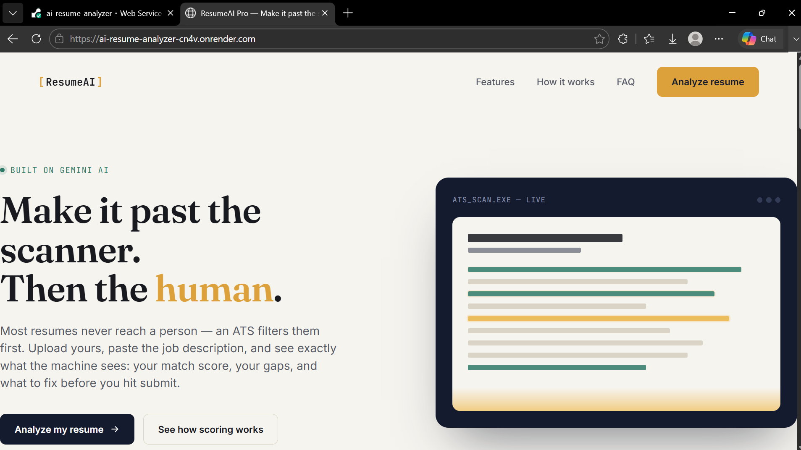
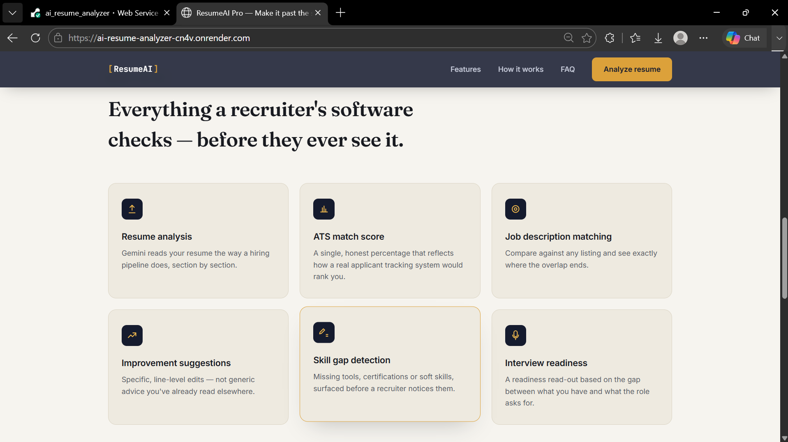
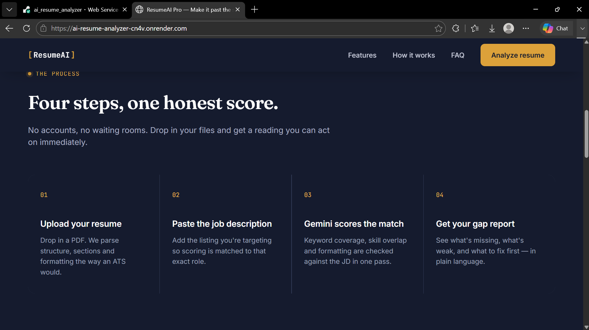
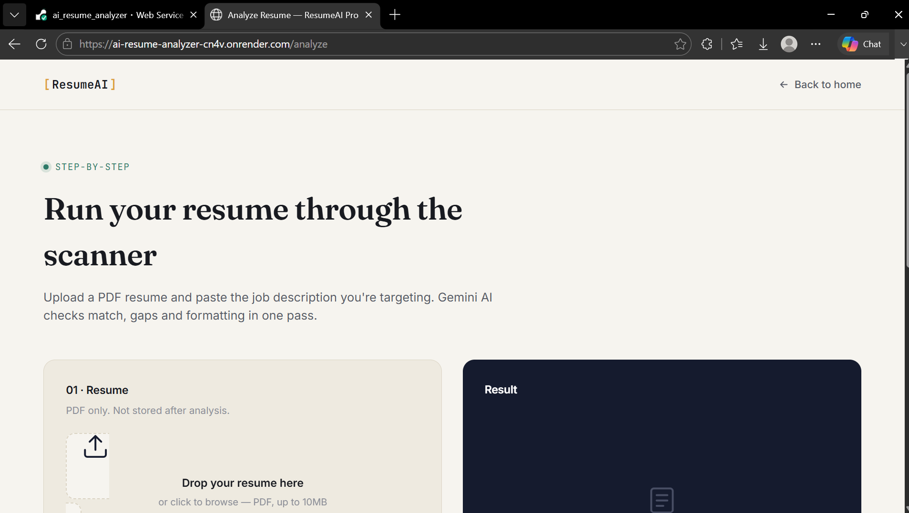
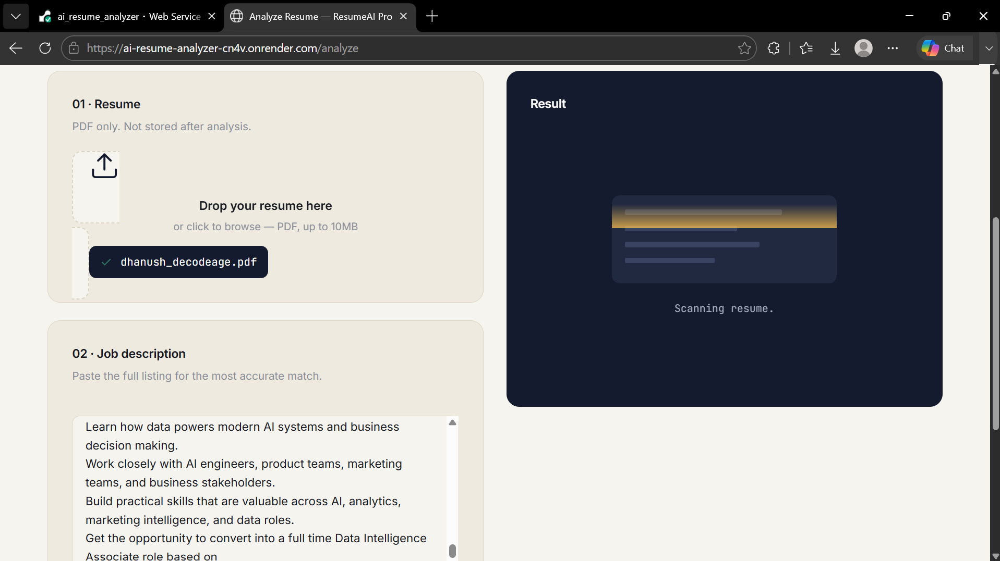
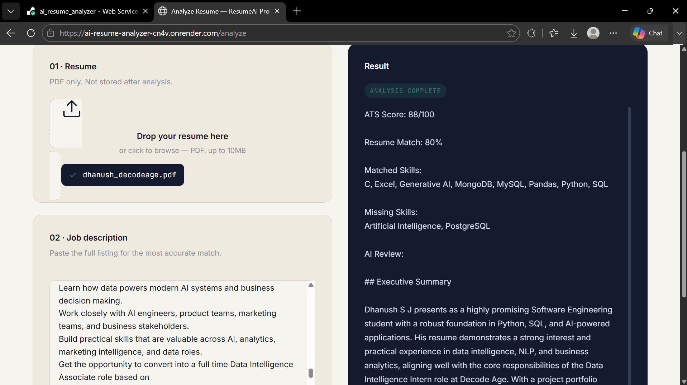
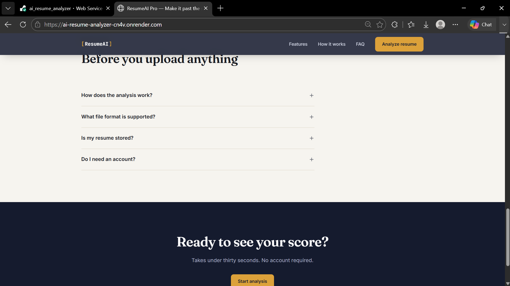

# AI Resume Analyzer & Hybrid ATS Checker

A professional AI-powered Resume Analyzer that combines a **rule-based ATS engine** with **Google Gemini AI** to analyze resumes, compare them with job descriptions, calculate ATS scores, identify missing skills, and provide personalized improvement suggestions.

## 🌐 Live Demo

**Website:** [https://ai-resume-analyzer-cn4v.onrender.com](https://ai-resume-analyzer-cn4v.onrender.com/)

## Features

- ✅ Hybrid ATS Engine
- ✅ Resume Parsing
- ✅ Job Description Matching
- ✅ ATS Score Calculation
- ✅ Keyword Matching
- ✅ Missing Skills Detection
- ✅ AI Resume Review (Gemini)
- ✅ Interview Readiness Score
- ✅ Learning Roadmap

## Features

### Hybrid ATS Engine

- ATS Score Calculation
- Resume Match Score
- Keyword Matching
- Contact Information Detection
- Skills Detection
- Experience Detection
- Education Detection
- Project Detection
- Certification Detection
- Resume Parsing

### Gemini AI Analysis

- Executive Summary
- Resume Strengths
- Resume Weaknesses
- Resume Improvements
- Project Review
- Missing Skills Explanation
- Interview Readiness Analysis
- Technical Interview Questions
- 30-Day Learning Roadmap
- Recruiter Feedback

---

## Tech Stack

### Backend

- Python
- Flask
- Gemini 2.5 Flash
- PyMuPDF
- spaCy
- RapidFuzz

### Frontend

- HTML5
- CSS3
- JavaScript

### AI

- Google Gemini API

---

## Project Architecture

```
Resume Upload
      │
      ▼
PDF Text Extraction (PyMuPDF)
      │
      ▼
Resume Parser
      │
      ▼
ATS Engine
      │
      ▼
Keyword Matching
      │
      ▼
Gemini AI Review
      │
      ▼
Professional Dashboard
```

---

## ATS Engine

The ATS Engine calculates:

- Contact Score
- Education Score
- Experience Score
- Project Score
- Skills Score
- Certification Score
- Resume Length Score
- Formatting Score
- Keyword Match Score

This score is generated using Python and does **not** rely on AI.

---

## AI Features

Gemini AI provides:

- Executive Summary
- Resume Review
- Strengths
- Weaknesses
- Resume Improvements
- Missing Skills Analysis
- Interview Readiness
- Technical Interview Questions
- Learning Roadmap
- Final Recruiter Opinion

---

## Installation

Clone the repository

```bash
git clone https://github.com/Dhanushsj12/ai_resume_analyzer.git
```

Go to the project

```bash
cd ai_resume_analyzer
```

Install dependencies

```bash
pip install -r requirements.txt
```

Download the spaCy model

```bash
python -m spacy download en_core_web_sm
```

Run the application

```bash
python app.py
```

---

## Environment Variables

Create a `.env` file in the project root.

```env
GEMINI_API_KEY=YOUR_GEMINI_API_KEY
```

---

## Project Structure

```
ai_resume_analyzer/

│── app.py
│── parser.py
│── ats_engine.py
│── keyword_match.py
│── ai_review.py
│── requirements.txt
│── .env

├── templates/
│   ├── index.html
│   └── analyze.html

├── static/

├── uploads/
```

---
# Screenshots

## Homepage



---

## Features



---

## Working Process



---

## Resume Analysis Page



---

## Analysis in Progress



---

## ATS Analysis Result



---

## Frequently Asked Questions


-----

## Future Enhancements

- Resume Rewrite using AI
- Cover Letter Generator
- Resume PDF Report
- Multiple Resume Comparison
- Job Recommendation System
- Resume Version History
- AI Career Advisor
- Recruiter Dashboard

---

## Author

**Dhanush S J**

GitHub: https://github.com/Dhanushsj12

LinkedIn: https://www.linkedin.com/in/dhanush-s-j-034147271

---

## License

This project is developed for educational and portfolio purposes.
